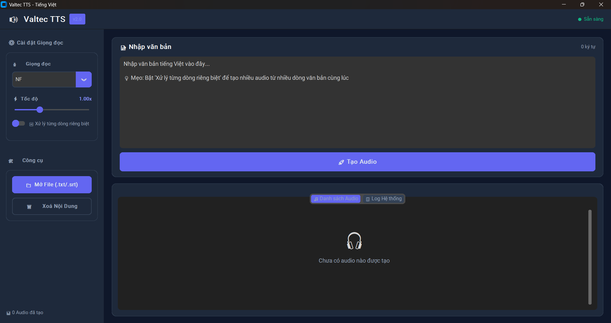

# Valtec Vietnamese TTS

Vietnamese Text-to-Speech with **Multi-Speaker TTS** and **Zero-Shot Voice Cloning**.

> **The lightest Vietnamese zero-shot voice cloning model** — only **74.8M parameters**, runs entirely on **CPU**, 3-4x faster than realtime. No GPU required.

> **📅 Cập nhật: Tháng 4/2026** — Đã phát hành phiên bản Windows App (.exe), không cần cài đặt Python hay chạy source code phức tạp!

## 📥 Download Windows App (Khuyến nghị)

> **Dành cho người dùng Windows** — Tải file `.exe`, chạy trực tiếp, không cần cài đặt Python, không lo lỗi source code!

| Phiên bản | Hệ điều hành | Download |
|-----------|-------------|----------|
| **v1.0.5** (Mới nhất) | Windows 10/11 (64-bit) | [📥 Tải ValtecTTS.exe (394MB)](https://github.com/tronghieuit/valtec-tts/releases/tag/v1.0.5) |

### ✨ Tính năng Windows App:
- ✅ **Không cần cài đặt Python** — Chạy trực tiếp file `.exe`
- ✅ **Không lo lỗi source code** — Đã đóng gói sẵn toàn bộ dependencies
- ✅ **Giao diện đẹp** — Dark mode hiện đại, dễ sử dụng
- ✅ **5 giọng đọc có sẵn** — NF, SF, NM1, SM, NM2 (Bắc/Nam, Nam/Nữ)
- ✅ **Xử lý hàng loạt** — Tạo nhiều audio từ file `.txt`/`.srt`
- ✅ **Tốc độ tùy chỉnh** — Điều chỉnh từ 0.5x đến 2.0x
- ✅ **Nghe thử & Lưu file** — Preview và export audio dễ dàng

###  Ảnh chụp ứng dụng:



### 🚀 Hướng dẫn sử dụng:
1. Tải file `ValtecTTS.exe` từ [Releases](https://github.com/tronghieuit/valtec-tts/releases)
2. Chạy file `.exe` (lần đầu sẽ tự tải model từ HuggingFace — cần kết nối Internet)
3. Nhập văn bản tiếng Việt → Chọn giọng đọc → Nhấn "Tạo Audio"
4. Nghe thử hoặc lưu file `.wav`

> **Lưu ý:** File `.exe` có dung lượng ~394MB do đã bao gồm toàn bộ PyTorch và dependencies. Lần chạy đầu tiên sẽ tải model (~100MB) từ HuggingFace.

---

## 🐳 Chạy bằng Docker (Windows / Mac / Linux)

> **Dành cho mọi hệ điều hành** — Chạy trong Docker, không cần cài đặt Python, cách ly hoàn toàn!

### Yêu cầu:
- [Docker Desktop](https://www.docker.com/products/docker-desktop/) đã cài đặt

### Cách chạy:

**Cách 1: Dùng docker-compose (Khuyến nghị)**
```bash
git clone https://github.com/tronghieuit/valtec-tts.git
cd valtec-tts
docker-compose up -d
```

**Cách 2: Dùng Docker trực tiếp**
```bash
docker build -t valtec-tts .
docker run -d -p 7860:7860 --name valtec-tts valtec-tts
```

Mở trình duyệt: **http://localhost:7860**

### ✨ Tính năng Docker:
- ✅ **Đa nền tảng** — Windows, macOS, Linux
- ✅ **Cách ly hoàn toàn** — Không ảnh hưởng hệ thống
- ✅ **Gradio Web UI** — Giao diện web đẹp, dễ dùng
- ✅ **Auto-download model** — Tự tải model lần đầu
- ✅ **5 giọng đọc** — NF, SF, NM1, SM, NM2

> **Lưu ý:** Docker image ~2-3GB do bao gồm PyTorch và dependencies. Lần chạy đầu tiên sẽ tải model từ HuggingFace.

---

## Highlights

- **🪶 Ultra-lightweight**: 74.8M params — the lightest Vietnamese zero-shot voice clone model
- **⚡ CPU-only**: RTF ~0.24 on CPU (4x faster than realtime), no GPU needed
- **🎯 Zero-shot**: Clone any voice from 3-10s of audio, no fine-tuning
- **🎨 Prosody Transfer**: Transfer intonation, rhythm, emotion from reference voice
- **🇻🇳 Vietnamese-native**: Dedicated Vietnamese phonemizer with Northern/Southern support
- **📦 Multi-speaker TTS**: 5 built-in Vietnamese voices (Northern/Southern, Male/Female)
- **🔌 Simple API**: `pip install` and use with 2 lines of code

## 🚀 Live Demo — Try it now!

| Demo | Link |
|------|------|
| **🎙️ Zero-Shot Voice Cloning** | [▶️ huggingface.co/spaces/valtecAI-team/valtec-zeroshot-voice-cloning](https://huggingface.co/spaces/valtecAI-team/valtec-zeroshot-voice-cloning) |
| **🔊 Multi-Speaker TTS** | [▶️ huggingface.co/spaces/valtecAI-team/valtec-vietnamese-tts](https://huggingface.co/spaces/valtecAI-team/valtec-vietnamese-tts) |

> Clone any voice from 3-10 seconds of audio. No GPU required. Try it directly in your browser!

**[▶️ Watch Zero-Shot Demo Video](https://github.com/tronghieuit/valtec-tts/raw/dev/examples/ValtecTTS%20-%20ZeroShot.mp4)**

---

## 🎧 Zero-Shot Voice Cloning Examples

Same text, cloned with 6 different reference voices:

| Reference Voice | Description | Cloned Audio |
|----------------|-------------|--------------|
| **Thu Hà** | Soft female voice | [▶️ example_thu_ha.wav](examples/zeroshot/example_thu_ha.wav) |
| **Minh Đức** | Deep male voice | [▶️ example_minh_duc.wav](examples/zeroshot/example_minh_duc.wav) |
| **Thanh Tâm** | Young female voice | [▶️ example_thanh_tam.wav](examples/zeroshot/example_thanh_tam.wav) |
| **Quang Huy** | Young male voice | [▶️ example_quang_huy.wav](examples/zeroshot/example_quang_huy.wav) |
| **Ngọc Ánh** | Professional female | [▶️ example_ngoc_anh.wav](examples/zeroshot/example_ngoc_anh.wav) |
| **Hoàng Nam** | Strong male voice | [▶️ example_hoang_nam.wav](examples/zeroshot/example_hoang_nam.wav) |

### Multi-Speaker TTS Examples

| Speaker | Region | Gender | Audio |
|---------|--------|--------|-------|
| **NF** | Northern | Female | [▶️ example_NF.wav](examples/example_NF.wav) |
| **SF** | Southern | Female | [▶️ example_SF.wav](examples/example_SF.wav) |
| **NM1** | Northern | Male | [▶️ example_NM1.wav](examples/example_NM1.wav) |
| **SM** | Southern | Male | [▶️ example_SM.wav](examples/example_SM.wav) |
| **NM2** | Northern | Male | [▶️ example_NM2.wav](examples/example_NM2.wav) |

> Clone the repo and listen to files in `examples/` for the best audio quality.

---

## ⚡ Performance — CPU is all you need

### Zero-Shot Voice Cloning (74.8M params)

| Component | Parameters | Purpose |
|-----------|-----------|---------|
| **Synthesizer** | 56.45M | Voice synthesis |
| **Speaker Encoder** | 8.03M | Voice identity extraction |
| **Style Encoder** | 7.80M | Prosody/style extraction |
| **Prosody Predictor** | 2.52M | F0/energy prediction |
| **Total** | **74.80M** | **~285 MB (FP32)** |

#### Zero-Shot CPU Benchmark

> Runs entirely on CPU — no GPU needed!

| Input Length | Inference Time | Audio Length | RTF | Speed |
|-------------|----------------|--------------|-----|-------|
| Short (16 chars) | **506ms** | 1.07s | 0.475 | **2.1x realtime** |
| Medium (60 chars) | **1,030ms** | 3.61s | 0.286 | **3.5x realtime** |
| Long (156 chars) | **2,229ms** | 9.45s | 0.236 | **4.2x realtime** |

### Multi-Speaker TTS (57.97M params)

| Mode | Short | Medium | Long |
|------|-------|--------|------|
| **CPU** (i5-14500) | 392ms / RTF 0.54 | 854ms / RTF 0.38 | 1,653ms / RTF 0.34 |
| **CUDA** (RTX 4060 Ti) | **45ms** / RTF 0.06 | **52ms** / RTF 0.02 | **69ms** / RTF 0.01 |

> **RTF (Real-Time Factor)**: Processing time / audio duration. RTF < 1 = faster than realtime.

---

## Installation

```bash
# From Git
pip install git+https://github.com/tronghieuit/valtec-tts.git

# From Source
git clone https://github.com/tronghieuit/valtec-tts.git
cd valtec-tts
pip install -e .
```

### Requirements

- Python 3.8+
- PyTorch 2.0+
- No GPU required (CUDA optional for multi-speaker acceleration)
- Linux recommended for best phonemization quality

---

## Quick Start

### Multi-Speaker TTS (2 lines)

```python
from valtec_tts import TTS

tts = TTS()  # Auto-downloads model from Hugging Face
tts.speak("Xin chào các bạn", speaker="NF", output_path="hello.wav")

# Get audio array
audio, sr = tts.synthesize("Xin chào các bạn", speaker="NM1")

# Available speakers: NF, SF, NM1, SM, NM2
print(tts.list_speakers())
```

### Zero-Shot Voice Cloning (2 lines)

```python
from valtec_tts import ZeroShotTTS

tts = ZeroShotTTS()  # Auto-downloads model, CPU by default
tts.clone_voice(
    text="Xin chào, tôi là giọng nói được nhân bản",
    reference_audio="your_voice.wav",
    output_path="output.wav"
)

# Or get audio array
audio, sr = tts.synthesize(
    text="Đây là văn bản tiếng Việt",
    reference_audio="references/thu_ha.wav"
)
```

### Command Line

```bash
# Zero-shot voice cloning
python infer_zeroshot.py \
  --reference references/thu_ha.wav \
  --text "Buổi sáng ở thành phố bắt đầu bằng những âm thanh quen thuộc" \
  --output cloned_voice.wav

# Use your own voice
python infer_zeroshot.py \
  --reference your_voice.wav \
  --text "Văn bản tiếng Việt của bạn" \
  --output output.wav --cpu

# Multi-speaker TTS
python infer.py --text "Xin chào các bạn" --speaker NF --output hello.wav
python infer.py --interactive
```

### Gradio Demos

```bash
# Zero-shot voice cloning demo
python app_zeroshot.py
# Open: http://localhost:7860

# Multi-speaker TTS demo
python app.py
```

---

## 🎤 Zero-Shot Voice Cloning — Details

### Architecture

```
Reference Audio
    ├─→ Speaker Encoder → Speaker Embedding (512-dim)
    └─→ Mel Extraction → Style Encoder → Prosody Embedding (128-dim)

Input Text → Vietnamese Phonemizer → Text Encoder → Text Representation

[Speaker Emb + Prosody Emb + Text Repr] → Voice Generator → Output Audio
```

#### Components

1. **Speaker Encoder (512-dim)** — Extracts speaker identity from raw audio waveform. L2-normalized for generalization.
2. **Style Encoder (128-dim)** — Extracts prosody/style from mel spectrograms (80 channels). Captures rhythm, emotion, speaking style.
3. **Prosody Predictor** — Predicts F0 (pitch) and energy contours from text + style embedding.
4. **Voice Generator** — Neural vocoder with style-dependent normalization (FiLM conditioning for F0/energy).

### Reference Audio Requirements

For best results:

| ✅ Good | ❌ Bad |
|---------|--------|
| 3-10 seconds duration | < 2s (poor representation) |
| Clean, clear speech | Noisy background |
| Single speaker | Multiple speakers |
| Neutral emotion | Extreme emotion/shouting |
| Any language | Music or sound effects |

```bash
# Prepare reference audio
ffmpeg -i full_audio.wav -ss 00:00:10 -t 5 -ar 24000 reference.wav
ffmpeg -i input.mp3 -ar 24000 -ac 1 reference.wav
```

### 6 Built-in Reference Voices

Available in `references/`:

| Voice | File | Description |
|-------|------|-------------|
| **Thu Hà** | `thu_ha.wav` | Soft, warm female voice |
| **Minh Đức** | `minh_duc.wav` | Deep, composed male voice |
| **Thanh Tâm** | `thanh_tam.wav` | Young, bright female voice |
| **Quang Huy** | `quang_huy.wav` | Young, energetic male voice |
| **Ngọc Ánh** | `ngoc_anh.wav` | Professional female anchor |
| **Hoàng Nam** | `hoang_nam.wav` | Strong, deep male voice |

> Upload your own reference audio (3-10 seconds, clear speech) to clone any voice.

### Advanced Usage

#### Speaker Interpolation

```python
# Blend two voices
spk_emb_1 = tts.extract_embeddings("voice_1.wav")[0]
spk_emb_2 = tts.extract_embeddings("voice_2.wav")[0]

alpha = 0.5  # 50-50 blend
spk_emb_mixed = alpha * spk_emb_1 + (1 - alpha) * spk_emb_2
```

### Limitations

- Vietnamese synthesis works best (model supports multiple languages but optimized for Vietnamese)
- Cannot improve upon reference audio quality
- Very unique voices may not be perfectly replicated
- Not optimized for real-time streaming (yet)

---

## 🔊 Multi-Speaker TTS — Details

### 5 Vietnamese Voices

| Speaker | Region | Gender | Code |
|---------|--------|--------|------|
| **NF** | Northern (Miền Bắc) | Female | `NF` |
| **SF** | Southern (Miền Nam) | Female | `SF` |
| **NM1** | Northern (Miền Bắc) | Male | `NM1` |
| **SM** | Southern (Miền Nam) | Male | `SM` |
| **NM2** | Northern (Miền Bắc) | Male | `NM2` |

### Parameters

| Parameter | Default | Description |
|-----------|---------|-------------|
| `speed` | 1.0 | < 1.0 = faster, > 1.0 = slower |
| `noise_scale` | 0.667 | Voice variability |
| `noise_scale_w` | 0.8 | Duration variability |
| `sdp_ratio` | 0.0 | 0 = deterministic, 1 = stochastic |

### Model Auto-Download

Models are automatically downloaded from Hugging Face and cached:

- Windows: `%LOCALAPPDATA%\valtec_tts\models\`
- Linux/Mac: `~/.cache/valtec_tts/models/`

---

## Project Structure

```
valtec-tts/
├── valtec_tts/           # pip install package
│   ├── tts.py            # Multi-speaker TTS API
│   └── zeroshot.py       # Zero-shot voice cloning API
├── src/
│   ├── models/           # All model architectures
│   │   ├── synthesizer_zeroshot.py  # Zero-shot synthesizer
│   │   ├── synthesizer.py          # Multi-speaker synthesizer
│   │   ├── encoders.py             # Speaker/Style/Prosody encoders
│   │   └── adain.py                # Style conditioning module
│   ├── nn/               # Neural network components + mel processing
│   ├── text/             # Text/phoneme processing
│   └── vietnamese/       # Vietnamese text normalization + phonemizer
├── pretrained/
│   ├── zeroshot/         # Zero-shot checkpoint + config
│   ├── hasp/             # Speaker encoder weights
│   ├── onnx/             # ONNX export models
│   └── config.json       # Multi-speaker config
├── references/           # 6 reference voices for zero-shot
├── examples/
│   ├── zeroshot/         # Zero-shot cloned audio samples
│   └── *.wav             # Multi-speaker audio samples
├── deployments/          # Edge / Web / Android deployments
├── infer_zeroshot.py     # Zero-shot CLI inference
├── infer.py              # Multi-speaker CLI inference
├── app_zeroshot.py       # Gradio demo (zero-shot)
└── app.py                # Gradio demo (multi-speaker)
```

## 📱 Deployment Options

| Platform | Technology | Size | Offline |
|----------|-----------|------|---------|
| **HuggingFace Spaces** | Gradio | Cloud | No |
| **Edge** | ONNX Runtime | ~165MB | Yes |
| **Web** | ONNX Runtime Web | ~165MB | Yes |
| **Android** | ONNX Runtime Mobile | ~185MB | Yes |

See `deployments/` for detailed guides.

## Citation

```bibtex
@software{valtec_tts,
  title = {Valtec Vietnamese TTS with Zero-Shot Voice Cloning},
  author = {ValtecAI Team},
  year = {2026},
  url = {https://github.com/tronghieuit/valtec-tts}
}
```

## License

[CC BY-NC 4.0](https://creativecommons.org/licenses/by-nc/4.0/) — Non-commercial use only. Commercial use requires written permission.

## Acknowledgments

- Valtec AI Team for model training and development
- Vietnamese phonemization community